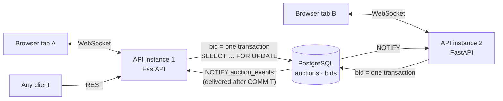

# Real-Time Bidding Backend

A live auction backend. Many bidders bid on the same item at the same time,
every connected client sees each new high bid the moment it commits, and the
database guarantees the right winner even when bids arrive in the same
millisecond.

**Stack:** Python 3.13 · FastAPI · WebSockets · PostgreSQL (row locks + LISTEN/NOTIFY) · asyncpg

```
300 bids released at the same instant, amounts 100..399 in random order

SAFE    row lock + one transaction per bid
  8 accepted, 292 rejected, in 0.50s (599 bids/s)
  [ ok ] final price 399 is the highest bid sent (399)
  [ ok ] winner is bidder-09; the highest bid came from bidder-09
  [ ok ] accepted bids only ever went up (0 times a lower bid replaced a higher one)

UNSAFE  read -> check -> write, no lock
  223 accepted, 77 rejected, in 0.38s (796 bids/s)
  [FAIL] final price 369 is the highest bid sent (399)
  [FAIL] winner is bidder-12; the highest bid came from bidder-09
  [FAIL] accepted bids only ever went up (106 times a lower bid replaced a higher one)
```

<sub>Output of `python scripts/race_demo.py --unsafe` on a laptop. The unsafe path exists only to show what the lock prevents.</sub>

---

## Requirements, and where each one is met

| Requirement | How | Proven by |
|---|---|---|
| **Live updates** pushed to connected clients | A WebSocket per auction. Each committed change is broadcast through Postgres `LISTEN/NOTIFY`, so it reaches clients on *every* API instance | `test_bid_is_pushed_to_every_connected_client`, `test_two_instances_share_live_updates` |
| **Race-safe bids**: highest wins, stale/lower rejected, not last-write-wins | Each bid is one transaction that takes the auction row lock (`SELECT … FOR UPDATE`) and checks the rules against the row *as it is now* | `test_concurrent_bids_highest_always_wins` (300 concurrent, 3 shuffles), `test_equal_simultaneous_bids_only_one_wins`, `scripts/race_demo.py` |
| **Persisted state**: a fresh load or reconnect sees the truth | Postgres is the only source of truth. A connecting client's first message is a snapshot read from the database, never from memory | `test_state_survives_a_server_restart`, `test_connect_receives_snapshot_from_database` |
| **Disconnects/reconnects** can't corrupt shared state | Sockets hold no auction state. Events carry a version number. Bids carry an idempotency key. An in-flight bid finishes even if its socket dies | `test_reconnecting_client_sees_what_happened_while_it_was_away`, `test_bid_resent_after_dropped_connection_is_not_doubled`, `test_lost_event_feed_is_followed_by_a_fresh_snapshot` |

The reasoning behind each choice, the alternatives I rejected, and a
failure-by-failure walkthrough are in **[docs/DESIGN.md](docs/DESIGN.md)**.

## Architecture



What happens when a bid arrives:

```sql
BEGIN;
SELECT … FROM auctions WHERE id = $1 FOR UPDATE;      -- 1. wait for the lock; concurrent bids queue here
SELECT … FROM bids WHERE request_id = $2;             -- 2. seen this request before? return that outcome
-- 3. check: auction open? amount >= current_price + min_increment?
INSERT INTO bids (…, status) VALUES (…);              -- 4. log the attempt, accepted or rejected
UPDATE auctions SET current_price = $amount,          -- 5. only if accepted
       leader = $bidder, version = version + 1 …;
SELECT pg_notify('auction_events', '{…}');            -- 6. queued; delivered only if we commit
COMMIT;
```

## Run it

### Option A: Docker (recommended)

```bash
docker compose up --build
```

This starts Postgres plus **two** API instances: <http://localhost:8000> and
<http://localhost:8001>. Open one in each tab and bid. Updates cross between the
two instances through Postgres, with no sticky sessions or shared memory.

### Option B: No Docker

You need Python 3.11+ and any PostgreSQL 14+.

```bash
python -m venv .venv
.venv/Scripts/activate          # Windows; on macOS/Linux: source .venv/bin/activate
pip install -r requirements-dev.txt
cp .env.example .env            # then point DATABASE_URL / TEST_DATABASE_URL at your Postgres
uvicorn app.main:app --reload
```

Migrations run automatically on startup.

No Postgres installed? `scripts/dev_db.py` runs a throwaway local one from the
`embedded-postgres` binaries, with no installer or admin rights needed:

```bash
npm install --prefix .devdb @embedded-postgres/windows-x64   # or darwin-arm64, linux-x64 …
python scripts/dev_db.py start                               # prints the URLs for .env
```

## See it work

| What | How |
|---|---|
| **Browser client** | Open <http://localhost:8000> in two tabs with different names. Use the *Failure drills* to drop the connection, go offline and queue a bid, or force a resync |
| **Race demo** | `python scripts/race_demo.py --unsafe` (server needs `ENABLE_UNSAFE_DEMO=true`) |
| **Reconnect walkthrough** | `python scripts/reconnect_demo.py`: a narrated run through a dropped connection, a stale offline bid, and a retried bid that must not count twice |
| **API docs** | <http://localhost:8000/docs> |

## Tests

```bash
pytest
```

The 25 tests run against a real Postgres (`TEST_DATABASE_URL`), because locking
can't be mocked. They cover the bid rules, 300-way concurrency, equal
simultaneous bids, duplicate retries, exactly-once closing with racing closers,
and end-to-end socket behaviour: live pushes, reconnects, a full server restart,
two instances sharing events, and the server's own event feed dropping.

## API

### REST

| Method | Path | |
|---|---|---|
| `POST` | `/auctions` | Create: `{title, description?, starting_price, min_increment?, duration_seconds?}` |
| `GET` | `/auctions` | List (open first, soonest ending first) |
| `GET` | `/auctions/{id}` | Snapshot: `{auction, bids, server_time}` |
| `GET` | `/auctions/{id}/bids?limit=&include_rejected=` | Bid history, newest first |
| `POST` | `/auctions/{id}/bids` | `{bidder, amount, request_id?}` → **201** accepted · **409** rejected (`bid_too_low`, `auction_closed`) · **200** duplicate of an accepted request · **503** busy, retry |
| `GET` | `/health` | Database + event-listener status |

Amounts are whole currency units (integers). Money never touches floating point.

### WebSocket: `/ws/auctions/{id}?bidder=<name>`

Leave out `bidder` to watch without bidding.

| Direction | Message |
|---|---|
| server → client | `snapshot` `{auction, bids, server_time}`: on connect, on `resync`, and after the server's event feed reconnects |
| server → client | `bid_accepted` `{auction, bid}`: broadcast to everyone on the auction |
| server → client | `auction_closed` `{auction}`: `auction.leader` is the winner |
| server → client | `bid_result` `{request_id, accepted, duplicate, reason, bid, auction}`: only to the bidder |
| client → server | `{"type": "bid", "amount": 1250, "request_id": "<unique per bid>"}` |
| client → server | `{"type": "resync"}` · `{"type": "ping"}` |

**Client rule:** keep the highest `auction.version` you've seen and ignore any
message with a lower or equal version. On reconnect, resend unanswered bids
with their original `request_id`.

Close codes: `4404` unknown auction · `4008` client too slow (reconnect for a
fresh snapshot) · `1012` server restarting.

## Project layout

```
app/
  bidding.py     the bid transaction, auction closing, and the deliberately unsafe demo path
  auctions.py    queries, snapshots, serialisation
  events.py      LISTEN connection with reconnect + resync
  hub.py         sockets per auction, bounded send queues
  realtime.py    WebSocket protocol
  main.py        REST API, wiring, startup/shutdown
  db.py          pool + migrations (advisory-locked, safe with many instances)
migrations/      SQL schema
static/          browser client (one HTML file, no build step)
scripts/         race_demo.py · reconnect_demo.py · dev_db.py
tests/           pytest suite (real Postgres)
docs/            DESIGN.md · DEPLOY_AWS.md
```

## Deploying

[docs/DEPLOY_AWS.md](docs/DEPLOY_AWS.md) covers two routes: a single EC2
instance with Docker Compose, or ECS Fargate behind an Application Load
Balancer with RDS PostgreSQL. It also covers the WebSocket-specific settings
(ALB idle timeout, keep-alive pings, and why sticky sessions aren't needed).

## Known limits

- **No authentication.** The bidder name is self-declared. In production it would come from a verified token (e.g. Amazon Cognito JWT), never from the client.
- **One hot auction is bounded by one row lock.** That is inherent: bids on one item must be ordered. About 600 bids/s on one auction on a laptop; different auctions don't block each other.
- **Not built:** proxy (max) bids, reserve prices, anti-sniping time extensions, rate limiting.
