# Real-Time Bidding Backend

[](https://github.com/yashrajkanawade357/Real-Time-Bidding-backend/actions/workflows/ci.yml)

A live auction server. Any number of people can bid on the same lot at the
same instant and the highest bid still wins: on every server instance, after
every dropped connection, and after a full restart.

**Python 3.13 · FastAPI · WebSockets · PostgreSQL row locks and LISTEN/NOTIFY**

**Live: [d3n4nep4m9xruh.cloudfront.net](https://d3n4nep4m9xruh.cloudfront.net)**. Running on AWS: EC2 behind CloudFront, two API instances behind nginx, deployed by one script.

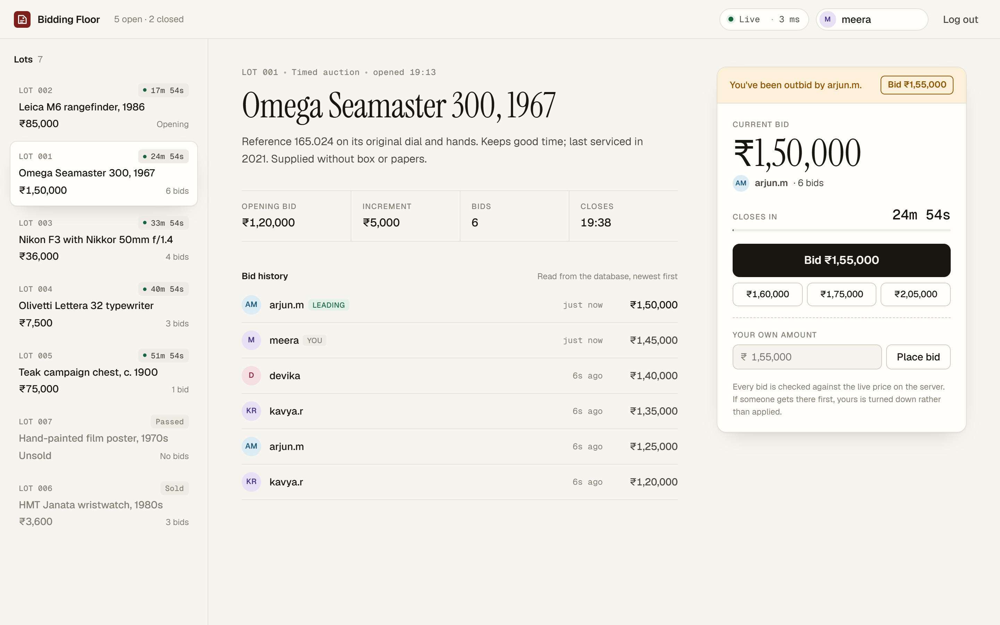

## Try it in 60 seconds

1. Open **[the live site](https://d3n4nep4m9xruh.cloudfront.net)** and click **Log in**, then **Create account**. Any email works; it is never shown to other bidders.
2. Go to **Enter the floor**, pick a lot and bid.
3. Open a **private/incognito window**, create a second account, and open the same lot. Outbid yourself from one window and watch the other change the moment the bid commits.
4. Back on the landing page, **Run the auction yourself** shows a judge access key. **Open the admin portal** unlocks `/admin` with it: open, close and remove lots, and watch every bid arrive live.
5. **[API docs](https://d3n4nep4m9xruh.cloudfront.net/docs)** lists every endpoint and lets you call it from the browser.

Watching needs no account. Bidding does.

## Two bidders, one lot

<p align="center">
  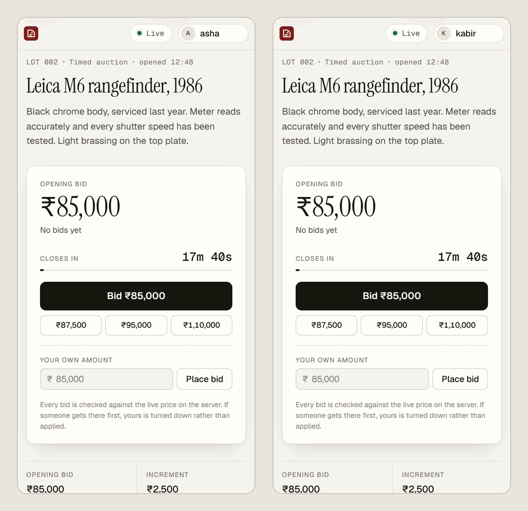
</p>

asha (left) and kabir (right) are signed in to two accounts and bid against
each other. Each bid shows up on the other screen the moment it commits.
Halfway through, asha goes offline and queues ₹97,500, based on the last price
she saw. While she's away, rohan.s bids ₹1,00,000. When she reconnects, her
app resends the queued bid and the server turns it down. Bids are judged
against the price **now**, never the price the bidder last saw.

## 300 bids in the same instant

`scripts/race_demo.py` opens 300 connections, then releases 300 bids at once
(amounts 100 to 399, shuffled). It runs them through the real bid path, then
through the same logic with the lock removed:

```text
$ python scripts/race_demo.py --unsafe --seed 1

SAFE    row lock + one transaction per bid
  9 accepted, 291 rejected, in 0.40s (755 bids/s)
  [ ok ] final price 399 is the highest bid sent (399)
  [ ok ] winner is bidder-29; the highest bid came from bidder-29
  [ ok ] accepted bids only ever went up (0 times a lower bid replaced a higher one)
  [ ok ] 9 bidders were told 'accepted'; the auction counts 9; 9 accepted rows stored

UNSAFE  read -> check -> write, no lock
  243 accepted, 57 rejected, in 0.34s (870 bids/s)
  [FAIL] final price 292 is the highest bid sent (399)
  [FAIL] winner is bidder-06; the highest bid came from bidder-29
  [FAIL] accepted bids only ever went up (123 times a lower bid replaced a higher one)
```

Without the lock, 243 people were told they had the high bid, and the lot
went to someone who bid 292 while 399 was on the table. It is a race, so the
numbers change from run to run. Across six runs, the unsafe path let lower
bids overwrite higher ones every time (102 to 134 times per run) and picked
the wrong winner in five. The safe path passed every check in every run, and
CI runs it on every push.

The unsafe endpoint exists only for this comparison and is off unless
`ENABLE_UNSAFE_DEMO=true`. It is off on the live server.

## How it stays correct

<p align="center">
  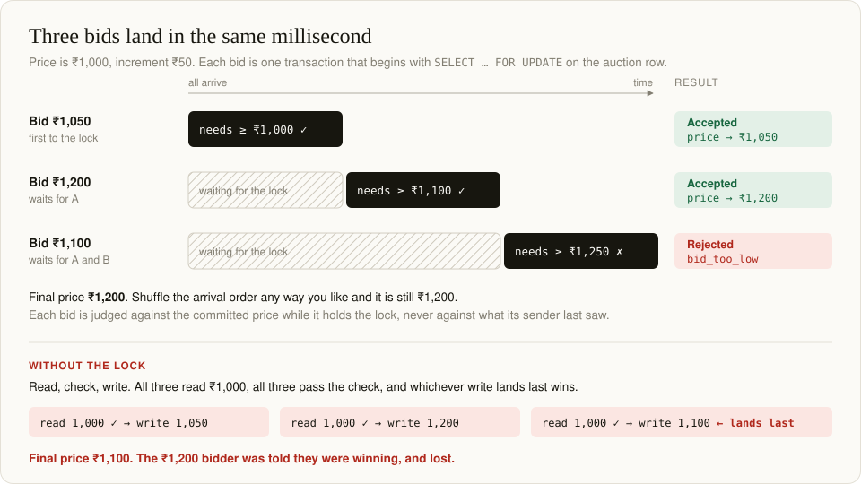
</p>

| Requirement | How | Proven by |
|---|---|---|
| **Live updates** to every connected client | A WebSocket per lot. Every committed change goes out through Postgres `LISTEN/NOTIFY`, so it reaches clients connected to *any* server instance | `test_bid_is_pushed_to_every_connected_client`<br>`test_two_instances_share_live_updates` |
| **Simultaneous bids decided correctly**: highest wins, stale and lower bids rejected, never last-write-wins | Each bid is one transaction that locks the lot's row (`SELECT … FOR UPDATE`) and checks the rules against the committed price | `test_concurrent_bids_highest_always_wins` (300 at once, three shuffles)<br>`test_equal_simultaneous_bids_only_one_wins` |
| **Persisted state**: a fresh load or reconnect sees the truth | Nothing lives only in memory. A client's first message is always a snapshot read from Postgres | `test_state_survives_a_server_restart` (kills the server, starts a new one) |
| **Disconnects can't corrupt anything** | Sockets hold no auction state. Every event carries a version. Every bid carries an idempotency key. A bid in flight finishes even if its socket dies | `test_bid_resent_after_dropped_connection_is_not_doubled`<br>`test_lost_event_feed_is_followed_by_a_fresh_snapshot` |
| **Bidding as yourself only** | The bidder name comes from the login session on the server, never from the request | `test_bids_need_a_login_and_use_the_accounts_name`<br>`test_sockets_bid_as_the_logged_in_account` |
| **No sniping** | A bid in the last 30 seconds pushes the end back, inside the same locked transaction | `test_a_late_bid_extends_the_auction`<br>`test_concurrent_late_bids_stay_consistent` |

<p align="center">
  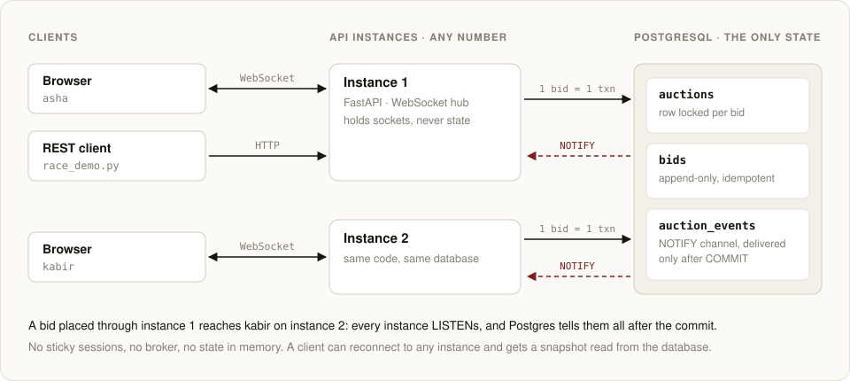
</p>

The full reasoning is in **[docs/DESIGN.md](docs/DESIGN.md)**: why a row lock
rather than Redis, `SERIALIZABLE` or an in-process mutex, how
subscribe-then-snapshot avoids missed events, and what happens in each failure
case.

## What a bidder sees

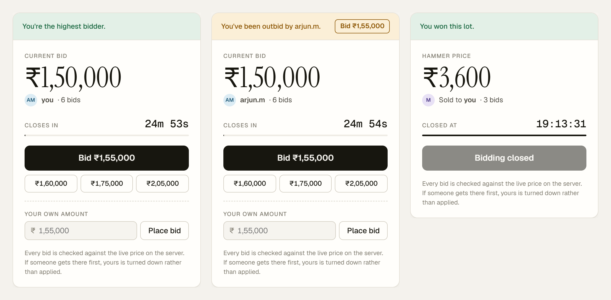

The bid button always offers the next valid amount. When someone overtakes
you, the panel says who did and offers the new minimum in one click. Countdown
times come from the server's clock, not the laptop's, so every bidder sees the
same deadline.

## Accounts

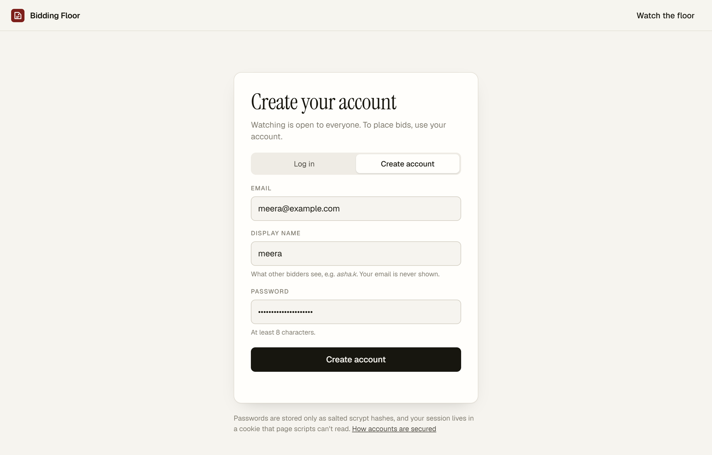

`/login` signs bidders up with an email, a password and a public display name.
Anyone can watch the floor; placing a bid needs an account (`REQUIRE_LOGIN=true`
on the live server).

- Passwords are stored only as salted **scrypt** hashes. A login for an unknown email still runs scrypt, so response times don't reveal who has an account.
- The session is a random 256-bit token in an **HttpOnly, SameSite, Secure** cookie. The database keeps only its SHA-256, so a leaked table can't be replayed. Sessions last 14 days.
- **Who bids is decided by the server.** Over REST and over the socket, the bidder is the signed-in account. A `bidder` field in the request is ignored, so nobody can bid under someone else's name.
- Requests and sockets from other websites are refused (CSRF and cross-site WebSocket hijacking), and repeated wrong passwords and mass sign-ups are throttled.

## Anti-sniping

A bid placed in the last 30 seconds (`SOFT_CLOSE_SECONDS`) moves the end to 30
seconds after that bid, the way auction houses keep the hammer from falling on
a last-second snipe. The extension is part of the bid's own `UPDATE`, under
the same row lock, so it can't race the bid or the closer. The lot page shows
**extended ×N** and every viewer gets the new deadline at once. Rejected bids
never extend anything.

## Break it on purpose

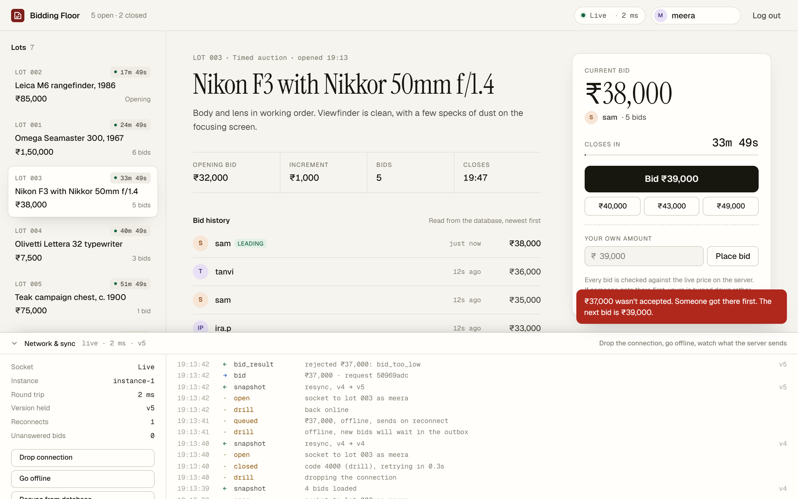

Open the floor with `?debug` (`/floor?debug`) and a **Network & sync** panel
appears at the bottom. It shows every message crossing the socket, with the
version each one carries and the server instance you landed on. It has three
drills:

- **Drop connection** kills the socket the way a network blip would. The client reconnects with exponential backoff and jitter, and resyncs from a database snapshot.
- **Go offline** keeps it down. Bids wait in an outbox and are resent with their original `request_id` on reconnect, so the server can de-duplicate them.
- **Resync from database** asks for a fresh snapshot on demand.

In the screenshot, meera went offline, queued ₹37,000, and on reconnect the
server rejected it: sam had bid ₹38,000 in the meantime.

## Landing page and admin portal

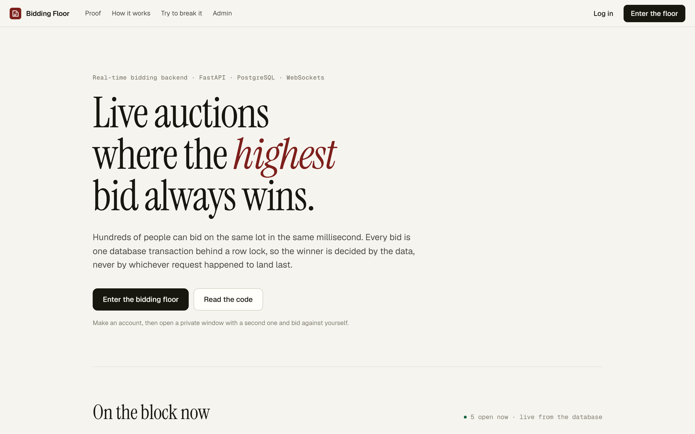

`/` introduces the project with the lots that are open right now, read live
from the API, the measured race results and the diagrams. The floor itself is
at `/floor`.

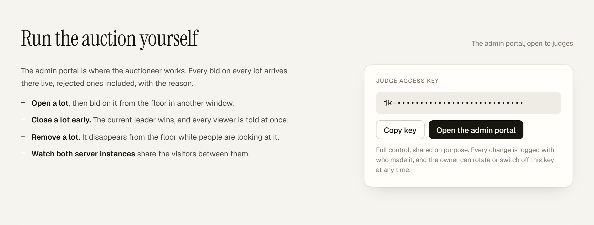

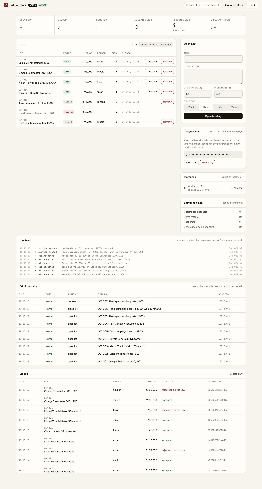

`/admin` unlocks with an **access key**. There are two:

- **The owner key**: the server generates it for itself on first boot, and it's never stored in the code.
- **A shareable judge key**: the landing page shows it, with a button that opens the portal ready to use, so judges can try everything without asking. Judges are capped at 12 open lots and 30 changes a minute, and can't touch keys.

The owner can rotate or switch off the judge key at any time, and the
**Admin activity** table logs every change with the key that made it. From the
portal the auctioneer can:

- **Run lots**: open them, close one early (the current leader wins), or remove one from the floor.
- **Watch every lot live**: a feed of every committed change, as Postgres announces it.
- **See which instances are up**, and how many sockets each one holds. This shows nginx spreading visitors across both.
- **Read the full bid log**, including rejected bids with their reasons and request ids.

On the public server, visitors can only bid; opening lots is admin-only.

## API docs

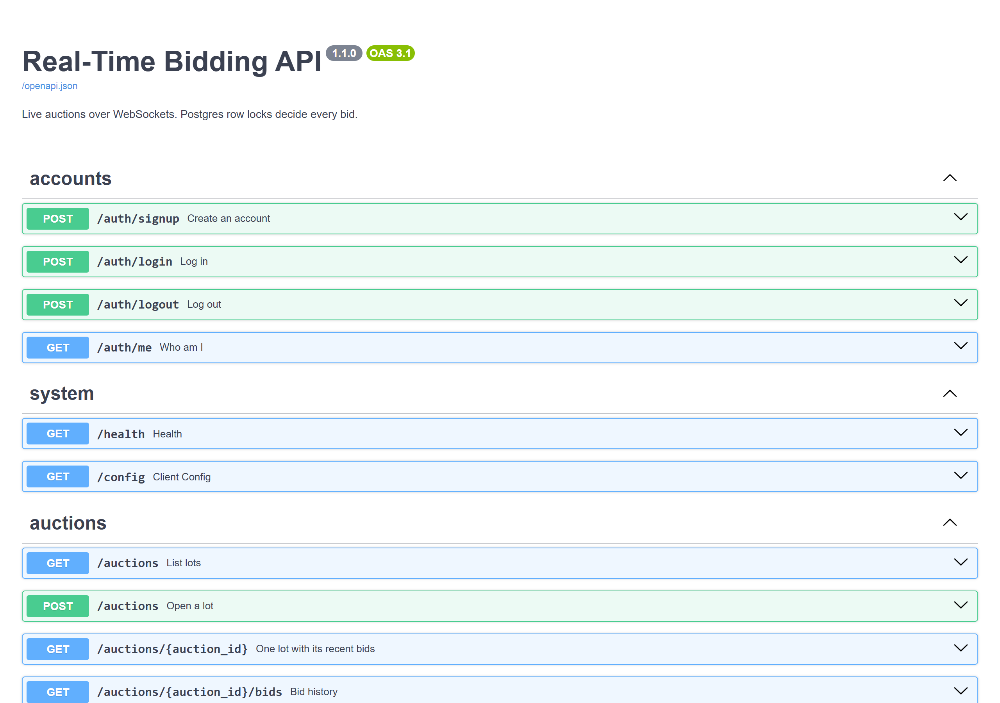

FastAPI generates **[interactive docs at /docs](https://d3n4nep4m9xruh.cloudfront.net/docs)**
from the code, so they can't drift from what the server does. Every endpoint
can be called from the page. The admin API is deliberately left out of them.

| Method | Path | |
|---|---|---|
| `POST` | `/auth/signup` | Create an account: `{email, password, display_name}`. Signs you in |
| `POST` | `/auth/login` · `/auth/logout` | `{email, password}`. Sets or clears the HttpOnly session cookie |
| `GET` | `/auth/me` | The signed-in account, if any |
| `GET` | `/auctions` | All lots: open first, soonest closing first |
| `GET` | `/auctions/{id}` | Snapshot: `{auction, bids, server_time}` |
| `GET` | `/auctions/{id}/bids` | History, newest first (`?limit=`, `?include_rejected=true`) |
| `POST` | `/auctions/{id}/bids` | Place a bid: `{amount, request_id?}` |
| `POST` | `/auctions` | Open a lot (only where `PUBLIC_LOT_CREATION=true`; off on the live server) |
| `GET` | `/health` | Database and event-listener status, and which instance answered |
| `GET` | `/config` | Whether bidding needs a login, the anti-sniping window, and the judge key when judge access is on |
| `WS` | `/ws/auctions/{id}` | Live channel for one lot. Signed out, it's watch-only |
| `*` | `/admin/api/…` | `overview`, `lots`, `lots/{id}/close`, `lots/{id}/remove`, `bids`, `activity`, `judge-key/…`. Needs `Authorization: Bearer <key>` |
| `WS` | `/ws/admin` | Every event for every lot. First message: `{"type": "auth", "key": "…"}` |

What a bid can come back with:

| Status | Meaning |
|---|---|
| `201` | Accepted: this is now the high bid |
| `200` | Same `request_id` as an accepted bid: the original result, not a second bid |
| `409` | Rejected, with the reason: `bid_too_low` or `auction_closed` |
| `401` | Log in to bid |
| `403` | Sent from another website |
| `429` | Too many bids from your address; slow down |
| `503` | The lot was busy; retry with the same `request_id` |

On the socket the server sends `snapshot`, `bid_accepted`, `auction_closed`,
`auction_removed`, and `bid_result` (only to the bidder). The client sends
`{"type": "bid", "amount": 1250, "request_id": "<unique>"}`, `resync`, or
`ping`. Every snapshot and event carries `auction.version`. Keep the highest
version you've seen and ignore anything at or below it.

Amounts are whole rupees stored as `BIGINT`. Money never touches floating point.

## Security

The live server is reachable only over HTTPS through CloudFront, and the
instance accepts traffic from CloudFront alone. Nothing else is exposed:
Postgres, SSH and the API containers can't be reached from the internet.

| Area | Controls |
|---|---|
| **Accounts** | scrypt-hashed passwords; HttpOnly, SameSite, Secure session cookies, stored hashed; wrong passwords throttled; other websites refused (CSRF and cross-site WebSocket hijacking) |
| **Admin** | Owner key and a shareable judge key, compared in constant time; locked out after 10 wrong tries; judges are capped, can't touch keys, and every change is logged by role |
| **Abuse** | Per-address rate limits for bids, sockets, sign-ups and new lots; body and message size caps |
| **Browser** | A strict Content-Security-Policy, with no inline scripts at all |
| **Secrets** | Generated on the server; none in the repository |
| **Dependencies** | Scanned for known vulnerabilities on every push |

**[docs/SECURITY.md](docs/SECURITY.md)** has the threat model, every control,
and the test that proves it. It also lists the risks accepted for a demo, with
what production would use instead.

## Run it locally

**With Docker:**

```bash
docker compose up --build
```

This starts Postgres and **two** API instances. Open
<http://localhost:8000/floor> in one window and <http://localhost:8001/floor>
in another, then bid. Updates cross between the instances through Postgres,
with no shared memory and no sticky sessions. A few lots open automatically
(`DEMO_RESTOCK`), so there's something to bid on straight away.

**Without Docker:** you need Python 3.11+ and PostgreSQL 14+.

```bash
python -m venv .venv
source .venv/bin/activate              # Windows: .venv\Scripts\activate
pip install -r requirements-dev.txt
cp .env.example .env                   # point DATABASE_URL at your Postgres
uvicorn app.main:app --reload
```

Migrations run on startup. No Postgres on the machine? `scripts/dev_db.py`
runs a throwaway one from the `embedded-postgres` binaries, with no installer
and no admin rights:

```bash
npm install --prefix .devdb @embedded-postgres/windows-x64   # or darwin-arm64, linux-x64
python scripts/dev_db.py start                               # prints the URLs for .env
```

The settings that change how it behaves, all in `.env` (every one is
documented in [.env.example](.env.example)):

| Setting | Default | |
|---|---|---|
| `REQUIRE_LOGIN` | `false` | `true` makes bidders sign in; the live server has it on |
| `ADMIN_KEY` | unset | 24+ random characters to unlock `/admin` as the owner |
| `JUDGE_ACCESS` | `false` | `true` creates the shareable judge key and shows it on the landing page |
| `SOFT_CLOSE_SECONDS` | `30` | The anti-sniping window; `0` turns it off |
| `DEMO_RESTOCK` | `false` | Keeps a few lots open so there's always something to bid on |

**Demos:**

```bash
python scripts/race_demo.py --unsafe   # server needs ENABLE_UNSAFE_DEMO=true
python scripts/reconnect_demo.py       # narrated: drop, stale offline bid, retried bid
```

Both create throwaway accounts on their own when the server requires a login.

## Tests and CI

```bash
pytest
```

68 tests against a real Postgres (`TEST_DATABASE_URL`). Locking behaviour
can't be mocked. They cover:

- the bid rules;
- 300-way concurrency;
- equal simultaneous bids;
- 25 concurrent retries of one request;
- closing exactly once while several closers race;
- end to end over real sockets: live pushes, reconnects, a full server restart, two instances sharing events, and the server's own event feed dropping mid-auction;
- every security control: headers, size caps, rate limits, client-address parsing, admin key checks and lockout, and private request ids;
- accounts: hashing, sessions, bidding only as yourself, cross-site requests refused, and throttling;
- anti-sniping, including 50 late bids at once;
- the admin portal and the judge key, end to end.

CI also scans dependencies with `pip-audit`, runs both demo scripts against a
live server, and boots the production stack (nginx in front of two instances)
to check load balancing, closed ports, the locked-down endpoints, and that
bidding without an account is refused.

## Deploying

The live demo is deployed from AWS CloudShell with one script:

```bash
bash deploy/aws-launch.sh launch      # firewall, EC2 instance, CloudFront; prints the https:// URL
bash deploy/aws-launch.sh update      # after a push: the instance pulls and rebuilds, same URL
bash deploy/aws-launch.sh admin-key   # prints the owner key the server generated
```

The instance sets itself up on first boot, with no SSH. [docs/DEPLOY_AWS.md](docs/DEPLOY_AWS.md)
walks through it, along with the production-shaped alternative: ECS Fargate
behind an Application Load Balancer, with RDS.

## Layout

```
app/
  bidding.py      the bid transaction, anti-sniping, closing, and the deliberately unsafe demo path
  auctions.py     queries, snapshots, serialisation
  events.py       the LISTEN connection, with reconnect and resync
  hub.py          sockets per lot, bounded send queues
  realtime.py     the WebSocket protocol, including the admin feed
  auth.py         accounts: scrypt passwords, session cookies, same-origin checks
  admin.py        the admin API behind the owner and judge keys
  security.py     security headers, size caps, client address, rate limiter
  demo.py         keeps a public demo stocked with open lots
  main.py         REST API, wiring, startup and shutdown
  db.py           pool and migrations (advisory-locked, safe with many instances)
migrations/       SQL schema
static/           landing, floor, login and admin pages: plain HTML, CSS and JS, no build step
deploy/           EC2 boot scripts, nginx, the AWS compose overrides, aws-launch.sh
scripts/          race_demo.py · reconnect_demo.py · dev_db.py
tests/            pytest suite against real Postgres
docs/             DESIGN.md · SECURITY.md · DEPLOY_AWS.md
```

## Known limits

- **Email addresses aren't verified.** Accounts are real and can't be impersonated, but anyone can sign up with any address. [SECURITY.md](docs/SECURITY.md) lists this and the other accepted risks, with production fixes.
- **One hot lot is bounded by one row lock.** That is inherent, because one lot's bids must be strictly ordered. On a laptop that is roughly 600 to 750 bids a second on a single lot. Different lots don't block each other.
- **Not built:** proxy (maximum) bids, reserve prices, password reset by email.
